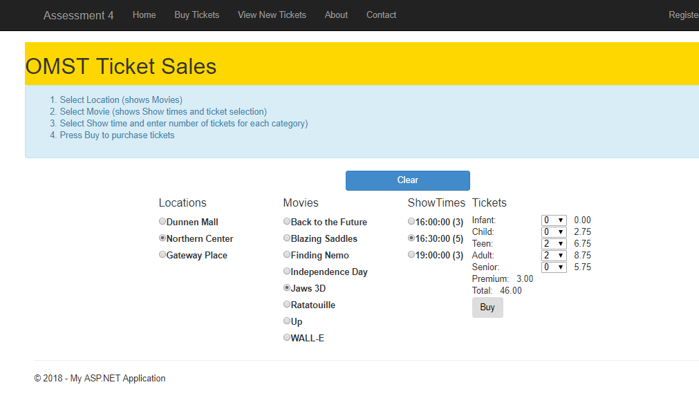
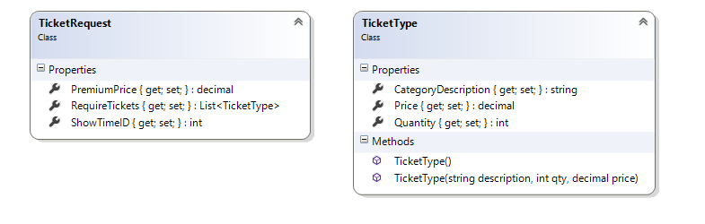
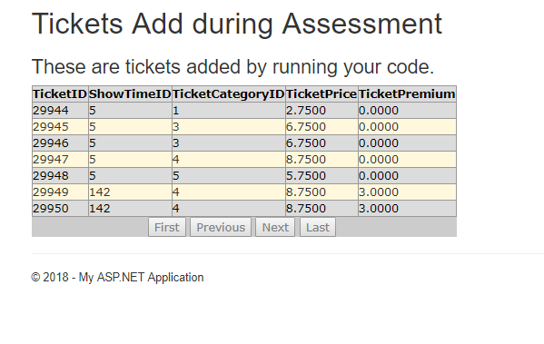
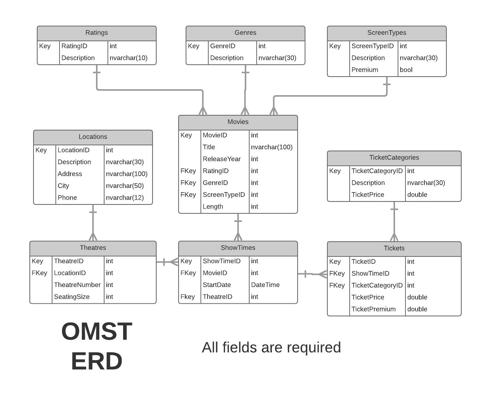

In-Class Assessment - CQRS

| **Your Name:** ______________________________ | **GitHub User Name:** ______________________________ |
| ---- | ---- |

> Place your name and your GitHub user name in the lines above. 

## Marking Summary

| Evaluation Item | Item Weight | Earned |
| ---- | --------- | --- |
| Web Form **Validation** (at least one Teen, Adult or Senior ticket) | 2 | 2 | 
| Web Form **Collect Data** Collect all required data for ticket purchase request | 3 | 3 |
| Web Form `MessageUserController` for **error handling** | 1 |  1 |
| Web Form `MessageUserController` for **user input validation** message | 1 | 1 |
| Web Form `MessageUserController` for **success** message | 1 | 1 |
| Controller class method: `Tickets_BuyTickets` Verify sufficient seats exist | 3 | 3 |
| Controller class method: `Tickets_BuyTickets` Correctly create ticket for each requested seat (ticket contains correct data) | 3 | 3 |
|Total | 14 | N/A|
### Marking Rubric

| Weight | Breakdown |
| ----   | --------- |
| **1** | 1 = Proficient (requirement is met) 0 = Incomplete (requirement not met) |
| **2** | 2 = Proficient (requirement is met) 1 = Limited (requirement is poorly met, minor errors) 0 = Incomplete (requirement not met, missing large portions) |
| **3** | 3 = Proficient (requirement is met) 2 = Capable (requirement is adequately met, minor errors) 1 = Limited (requirement is poorly met, major errors) 0 = Incomplete (requirement not met, missing large portions) |

----

## Database

The physical database can be installed from the `.bak` file in the starter kit. Delete and restore this version of the database using SQL Server Management Studio.

## About OMST

> **Off Main Street Theatres** is a local movie theatre chain with multiple locations.

## CQRS

In this assessment, you will be evaluated on the following:

- Collect data from a web form for processing as a Transaction.
- Implement a controller method processing n records within a Transaction.
- Implement logical validation within a web form event and BLL controller method.

You have been supplied a starting solution for this assessment called AssessmentOMST in your assessment classroom repository. The repository contains the database in a .bak (backup file) called OMST_2018.bak. The starting solution has certain portions of the assessment pre-coded. **This code works and should not be altered.**

You are to complete each of the activities to create a successful solution to this assessment. You will need to use specified names in portions of the activities to integrate with the existing code. You many need to create local variables to use in your answer (these variables can be called whatever you wish). Use the following activity instructions to complete this assessment.

### Submission:

Commit your work at the end of every Activity. Ensure you sync your local clone to the classroom on github before the end of class. The classroom access ends at the end of class.

### Activity Setup

Restore the supplied SQL database. The database name is **OMST_2018**. The database contains data for testing your solution. Run the solution. You should be able to open all forms. The View New Tickets should show an empty display. The Buy Tickets should allow you to:

- Select a Location (which will show movies for a specific date; Dec 27 2017 has been used and show not be changed)
- Select a Movie (which will show ShowTimes and Theatre Number; area for indicating number of tickets desired by category; ticket price for the category; ticket premium of movie; total for desired tickets and a Buy button)
- Select a ShowTime will enable the Buy button
- Selecting a ticket quantity will calculate total ticket price (ticket price + premium)
- Clear resets form; location, movie, and showtime selection will do appropriate partial resets 

> No commit is needed as no changes have been made yet.

### Activity 1: Web Form Event `Buy_Click()`

Within this event you will verify that at least one Teen, Adult or Senior ticket is to be purchased. The theatre has a rule of no unattended infants or children. If no Teen, Adult or Senior ticket is being purchase, you cannot continue with the event. Display an appropriate message to the user. If purchasing can continue, record the number of tickets being purchased for each ticket category and the ticket price. Collect the showtime identifier and the ticket premium. Infants are not charged a *Premium* amount (though they do take up a seat in the theatre). Pass all this data to the BLL controller method for processing. Processing must be contained in user friendly error handling. Display an appropriate message if the tickets were successfully processed. A View Model class has been created to carry the data: `TicketRequest`.

## Activity 2: Contoller method `TicketsController.Tickets_BuyTickets()`

Within the BLL controller method, verify that there are sufficient seats for the purchase request. Data is contained in an instance of the View Model class called TicketRequest. If there are sufficient seats for the purchase request, create a ticket for each seat in the purchase request. Process this purchase request within a single transaction.

Your solution contains a link (*View New Tickets*) to a fully-functional web form to view newly created tickets; use this page to check your results.

----

## ERD

